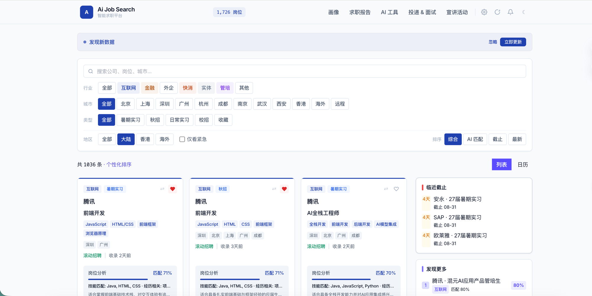
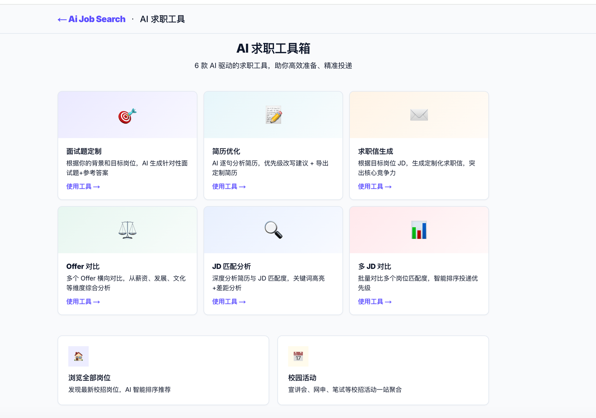
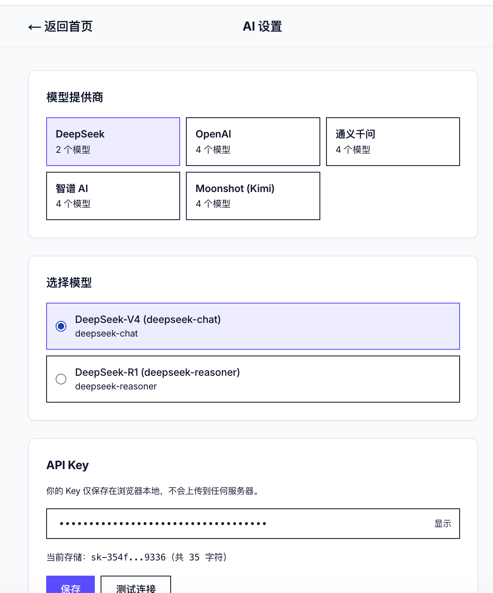

# Ai Job Search

上传简历，AI 告诉你今天该投哪家。

一个面向校招/实习的智能求职平台。1700+ 岗位通过 8 个数据源自动聚合，AI 为每个岗位打上结构化标签，再根据你的简历画像实时计算匹配度。不同的人打开同一个页面，看到的排序完全不同。

## 使用界面

### 首页



### AI 求职工具箱



### AI 设置



## 它能干什么

**简历解析**：上传 PDF，DeepSeek 在 5 秒内提取你的学校、技能、实习经历、优劣势，生成结构化画像。

**智能匹配**：岗位按技能命中率、方向契合度、行业相关性、城市偏好四个维度加权打分。产品经理和后端工程师看到的排序完全不同。

**AI 工具箱**：针对具体岗位生成定制面试题、简历润色建议、求职信；支持多 Offer 对比、简历一键定制、JD 关键词分析。

**投递追踪**：表格、时间线、看板三种视图管理投递进度。面试记录支持自然语言输入，AI 自动解析为结构化数据。

**宣讲活动**：搜狗微信爬取 + 公众号文章聚合，不错过任何宣讲信息。

## 技术栈

| 层 | 选型 | 说明 |
|---|------|------|
| 框架 | Next.js 14 | SSG + API Routes，零服务器运维 |
| 语言 | TypeScript | 类型安全，减少运行时错误 |
| 样式 | Tailwind CSS | 专业商务风格，深色模式支持 |
| AI | DeepSeek / OpenAI / 通义千问 / 智谱 / Moonshot | 多模型切换，用户自带 API Key |
| 数据 | JSON 文件 | 静态存储，构建时生成 |
| 部署 | Vercel | 免费，自动 CI/CD |
| 爬虫 | GitHub Actions | 每日自动执行，数据刷新 |
| 存储 | localStorage | 个人数据本地存储，无需后端数据库 |

## 架构

```
GitHub Actions（每日 06:23）
  │
  ├─ 8 个数据源爬虫（Greenhouse/Lever/Ashby/GitHub/牛客/搜狗微信/大厂官网/Boss）
  │
  ├─ AI 标签生成（DeepSeek 给每个岗位打结构化标签）
  │
  └─ 自动部署到 Vercel

浏览器端
  │
  ├─ 首页：多维筛选 + 匹配排序 + 公司多样性控制
  ├─ 岗位详情：AI 分析 + 面试题生成 + 求职信生成
  ├─ 画像管理：PDF 上传 → AI 解析 → 技能/经历/方向
  ├─ 投递追踪：三视图 + 面试记录 + 双向同步
  ├─ AI 工具：简历润色 / Offer 对比 / JD 分析 / 方向模版
  └─ 求职教练：数据分析 + 行动建议 + 周计划
```

## 快速开始

### 一键启动

macOS 用户双击 `启动服务.command`，Windows 用户双击 `启动服务.bat`。

### 手动启动

```bash
git clone https://github.com/AZULinn/ai-job-search.git
cd ai-job-search
npm install
npm run dev
```

浏览器打开 `http://localhost:3000`。

### 配置 AI

无需设置环境变量。在 `/settings` 页面输入你的 API Key：

- DeepSeek — [platform.deepseek.com](https://platform.deepseek.com/)
- OpenAI — [platform.openai.com](https://platform.openai.com/)
- 通义千问 — [dashscope.aliyun.com](https://dashscope.aliyun.com/)
- 智谱 AI — [open.bigmodel.cn](https://open.bigmodel.cn/)
- Moonshot — [platform.moonshot.cn](https://platform.moonshot.cn/)

Key 只保存在浏览器本地，不会上传到任何服务器。

### 可用命令

```
npm run dev        启动开发服务器
npm run build      构建生产版本
npm run crawl      爬取岗位数据 + AI 标签
npm run crawl:boss Boss 直聘手动爬取
```

## 页面一览

| 路径 | 功能 |
|------|------|
| `/` | 首页 — 筛选、排序、岗位卡片 |
| `/job/[id]` | 岗位详情 — JD 分析、AI 面试题、求职信 |
| `/profile` | 画像管理 — PDF 上传、技能设置、经历录入 |
| `/report` | 求职报告 — 匹配分布、技能缺口、投递策略 |
| `/skills` | AI 工具 — 面试题、简历润色、Offer 对比 |
| `/timeline` | 投递追踪 — 表格/时间线/看板 + 面试记录 |
| `/settings` | AI 设置 — 模型选择、API Key 管理 |
| `/events` | 宣讲活动 — 搜索、筛选、公众号文章 |

## 匹配算法

两层设计：

**离线层**：GitHub Actions 每天调用 DeepSeek，为 1700+ 个岗位生成结构化标签（技能需求、岗位方向、行业属性、资历要求）。

**在线层**：浏览器端根据用户画像实时计算匹配分——

```
技能命中 30% + 方向契合 20% + 经历相关 15% + 行业匹配 15% + 城市偏好 10% + 公司相关 10%
```

公司多样性控制确保同一家公司不会霸榜。

## 数据来源

| 数据源 | 采集方式 | 说明 |
|--------|----------|------|
| Greenhouse | API | 海外科技公司 |
| Lever | API | 海外科技公司 |
| Ashby | API | 海外科技公司 |
| GitHub 社区仓库 | 爬取 | 校招信息汇总 |
| 牛客网 | 爬取 | 国内讨论区 |
| 搜狗微信 | 爬取 | 宣讲会 + 公众号文章 |
| 大厂官网 | API | 字节/腾讯/百度/美团等 |
| Boss 直聘 | Puppeteer | 半自动，手动触发 |

每条岗位都保留官方投递链接，未确认的字段留空不编造。

## 项目结构

```
ai-job-search/
├── app/                  页面路由
│   ├── api/              API 接口（爬虫、AI 代理）
│   ├── job/[id]/         岗位详情
│   ├── profile/          画像管理
│   ├── report/           求职报告
│   ├── skills/           AI 工具
│   ├── timeline/         投递追踪
│   └── settings/         AI 设置
├── components/           React 组件
├── lib/                  核心逻辑
│   ├── deepseek.ts       AI 多模型封装
│   ├── matchScore.ts     匹配算法
│   ├── filter.ts         筛选排序
│   ├── tracker.ts        投递追踪
│   └── skills.ts         AI 工具函数
├── scripts/              爬虫脚本
├── data/                 岗位数据（JSON）
├── config/               配置文件
├── 启动服务.command       macOS 一键启动
└── 启动服务.bat           Windows 一键启动
```

## 成本

| 项目 | 费用 |
|------|------|
| Vercel 部署 | 免费 |
| GitHub Actions | 免费（公开仓库） |
| DeepSeek API | 约 ¥1/百万 token |

个人使用基本零成本。

## License

[MIT](./LICENSE)
